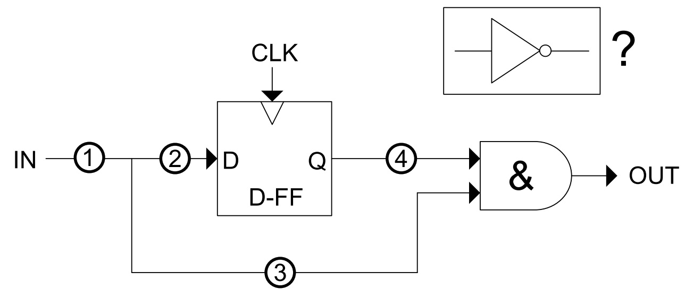
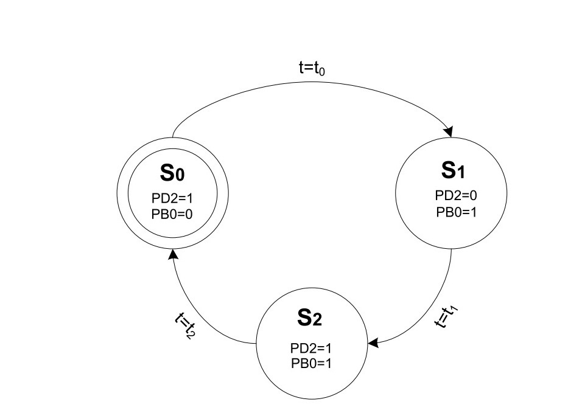

# Übung 10
## Frage 1 (30 Punkte )

*Einzelaufgabe:*

Bitte beantworten Sie kurz die folgenden Fragen. Sie benötigen hierfür das AVR Handbuch (welches Sie in den Kursunterlagen im Blackboard finden).
 
- Geben Sie die notwendigen Assemblerbefehle an, um den Timer 2 des ATMega8 mit dem Vorteiler CLK/64 zu aktivieren. Es soll weiterhin ein Interrupt eingerichtet werden, der ausgelöst wird, sobald der Timer die Hälfte seiner maximalen Zählschritte erreicht hat (Hinweis: Vergleich durch Timer Output Compare Match und Auslösung des zugehörigen Interrupts). Geben Sie nur die Befehle für die Aktivierung des Timers und des Interrupts an, d.h. weitere Teile des Hauptprogramms und der Interruptserviceroutine (ISR) sind nicht notwendig. Sie können - neben dem Handbuch Seite 115 ff. - das Assemblerprogramm [timer.asm](timer.asm) aus den Kursunterlagen hierfür als Hilfestellung verwenden.
 
- Der Timer 1 des ATMega8 besitzt 16-Bit Register u.a. `TCNT1`, `OCR1A/B` und `ICR1`, die jedoch aufgrund von Sparmaßnahmen individuell nur mit jeweils 8 Bit an den Datenbus angebunden sind. Die verbleibenden 8-Bit werden über ein gemeinsames Temporärregister vom Datenbus gelesen und geschrieben. Welche Konvention muss beim Schreiben und Lesen von 16-Bit Werten bei dieser Einschränkung eingehalten werden?
 
- Nehmen Sie an, dass sowohl Timer 0 als auch Timer 1 vom AVR gleichzeitig verwendet werden. Nun setzt ein Programm den Timer 1 sowie den zugehörigen Vorteiler per Reset auf Null zurück. Welche Implikation hat das für Timer 0?

## Frage 2 (25 Punkte)

*Einzelaufgabe*:

In der Vorlesung wurde eine Schaltung besprochen, die steigende Flanken auf einem Eingangssignal erkennt und eine auftretende Flanke angeschlossenen Komponenten exakt einen Taktzyklus lang signalisiert. Die folgende Abbildung zeigt einen fast vollständigen Flankendetektor (bestehend aus D-Flipflop und UND-Gatter), in dem ein Inverter aber noch fehlt.
 
An welcher Position 1 bis 4 muss der Inverter eingesetzt werden, damit die Schaltung als Detektor für eine fallende Taktflanke fungiert? Spielen Sie die Signalverläufe aller Möglichkeiten durch und geben Sie diese in ihrer Lösung an. Legen Sie dann kurz in Ihrer Lösung in Textform dar, mit welcher Konfiguration eine sinnvolle Funktion erreicht wird und wie sich das Ausgangssignal jeweils gegenüber des Eingangssignals verhält.

**Hinweis:** Der AVR µC besitzt einen variablen Flankendetektor, der in einer Schaltung wahlweise fallende oder steigende Flanken erkennen kann (vlg. Seite 72 des AVR Handbuchs).

## Frage 3 (45 Punkte)

*Gruppenaufgabe:*

In dieser Aufgabe wollen wir das Programm aus der letzten Übung als Echtzeitsystem mit Hilfe einer Automatensteuerung realisieren. Zu implementieren ist eine LED-Leuchtsequenz, in der die Status-LED (grün über PB0, rot über PD2) im einem definierten Zeitabstand ti nacheinander in bestimmten Farben leuchten lässt. Der zugehörige Automat ist in [automat.jpg](automat.jpg) dargestellt.

 
 
Sie sollen nun mit Hilfe des Timers 0 diesen Automat auf dem ASURO realisieren. Implementieren Sie dazu die Zustandsübergangsfunktion (d.h. der Wechsel von einem Zustand Si in den nächsten Zustand Si+1) in der ISR des Timer-Overflow-Interrupts. Verwenden Sie hierzu das gegebene Programm [timer.asm](timer.asm), welches Ihnen eine einfache Echtzeitssteuerung für die Zeitbasis 100 ms zur Verfügung stellt.
 
- Nehmen Sie zuerst an, dass die Zeitabstände zwischen den Zuständen gleich sein sollen. In diesem Fall soll `t0=t1=t2=500 ms` gelten. Der einfachste Weg zur Implementierung ist, die Zeitbasis des vorliegenden Programms von 100 ms auf 500 ms zu erhöhen, so dass der Zustand direkt nach Verstreichen einer Zeitbasiseinheit gewechselt werden kann. Bestimmen Sie für den vorgegeben Prescalers `x=256` die notwendigen Konstanten (d.h. die Anzahl an Zählerüberläufen wie auch verbleibende Timerticks, sowie entsprechender Startwert bis zu vollen 500 ms), um mit dem vorgegebenen Programms [timer.asm](timer.asm) (und der aktuellen Vorteilereinstellung) die Zeitbasis von 500 ms zu erhalten. Diese Werte müssen sie nicht explizit abgeben, da Sie sie in Aufgabenteil (b) benötigen.
 
- Implementieren Sie die Zustandsübergangsfunktion des obigen Automaten unter Verwendung der Zeitbasis von 500 ms. Am einfachsten verwenden Sie dafür ein globales Register (R17), welches den aktuellen Zustand S ∈ {0, 1, 2} speichert. Dieses muss - nach Ablauf der Wartezeit von 500 ms - in der Timer-ISR abgefragt und beim Zustandsübergang (zusammen mit dem Wechsel der LED-Farbe) auf den nächsten Zustand gesetzt werden. **Hinweis:** Falls Sie kompliziertere Verfahren bevorzugen, können Sie auch versuchen, den aktuellen Zustand direkt aus dem LED-Status zu interpretieren (d.h. kein globales Statusregister R17 zu benutzen). Ein weitere Alternative ist die Verwendung so genannter Callback-Funktionen, die in Assembler beispielsweise mit Hilfe des indirekten Sprungbefehls IJMP realisiert werden können. Dabei entwickeln Sie individuelle 'Unterfunktionen' für jeden Zustand Si, die lediglich die Befehle für das Setzen der LED-Farbe beinhaltet. Diese werden nun – je nach aktuellem Zustand – indirekt (über den Z-Zeiger) aus der ISR angesprungen. Der Z-Zeiger fungiert hier gewissermaßen als eine Art Statuszeiger, der aber keinen Zustand {0, 1, 2} sondern ein Befehlsadresse beinhaltet, an der sich die nächste Knotenübergangsfunktion befindet. Beachten Sie dabei auch, dass Sie korrekt aus der Callback-Unterfunktion in die ISR zurückkehren und dass am Ende jeder Knotenübergangsfunktion der Statuszeiger (Z-Zeiger) auf die Befehlsadresse der nächsten Übergangsfunktion gesetzt werden muss.
 
- Die LED-Phasen sollen nun unterschiedlich lange leuchten. Gegeben seien nun die Wartezeiten `t0=600ms`, `t1=1200ms` und `t2=1800ms`. Welche Zeitbasis würden Sie dafür verwenden? Welche Änderungen müssten Sie insgesamt an Ihrem obigen Programm vornehmen, um die unterschiedlichen Wartezeiten zu realisieren? Eine kurze aber präzise Beschreibung genügt bereits. Schreiben Sie die Antwort in den vorgesehenen Teil der asm-Datei.
