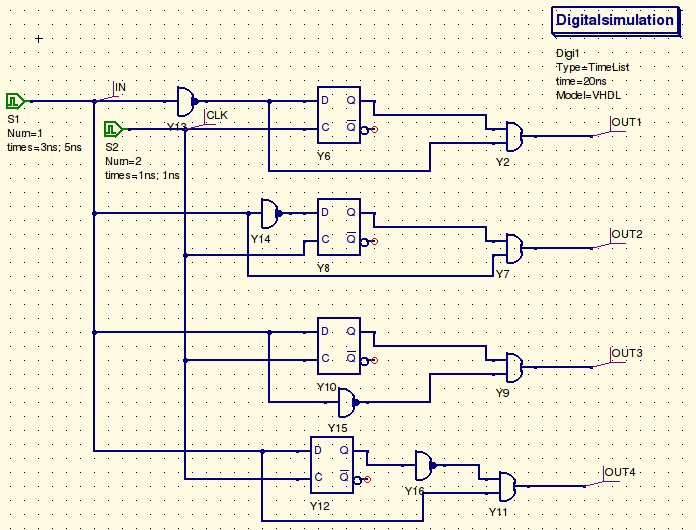
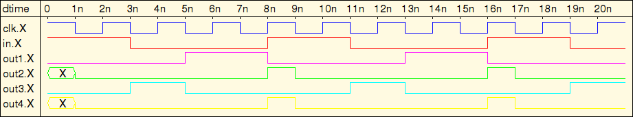

# Übung 10
## Frage 2 (25 Punkte)

*Einzelaufgabe*:

In der Vorlesung wurde eine Schaltung besprochen, die steigende Flanken auf einem Eingangssignal erkennt und eine auftretende Flanke angeschlossenen Komponenten exakt einen Taktzyklus lang signalisiert. Die folgende Abbildung zeigt einen fast vollständigen Flankendetektor (bestehend aus D-Flipflop und UND-Gatter), in dem ein Inverter aber noch fehlt.
 
An welcher Position 1 bis 4 muss der Inverter eingesetzt werden, damit die Schaltung als Detektor für eine fallende Taktflanke fungiert? Spielen Sie die Signalverläufe aller Möglichkeiten durch und geben Sie diese in ihrer Lösung an. Legen Sie dann kurz in Ihrer Lösung in Textform dar, mit welcher Konfiguration eine sinnvolle Funktion erreicht wird und wie sich das Ausgangssignal jeweils gegenüber des Eingangssignals verhält.

**Hinweis:** Der AVR µC besitzt einen variablen Flankendetektor, der in einer Schaltung wahlweise fallende oder steigende Flanken erkennen kann (vlg. Seite 72 des AVR Handbuchs).

### Lösung

Der Inverter muss sich an Position 3 befinden. Das Ausgangssignal wird immer dann für genau einen vollen Taktzyklus 1, wenn im Eingangsignal eine fallende Flanke aufgetreten ist, sonst wird es 0.

#### Schaltung

[Qucs-Schematic](aufgabe2-schaltung.sch)

#### Signalverlauf

