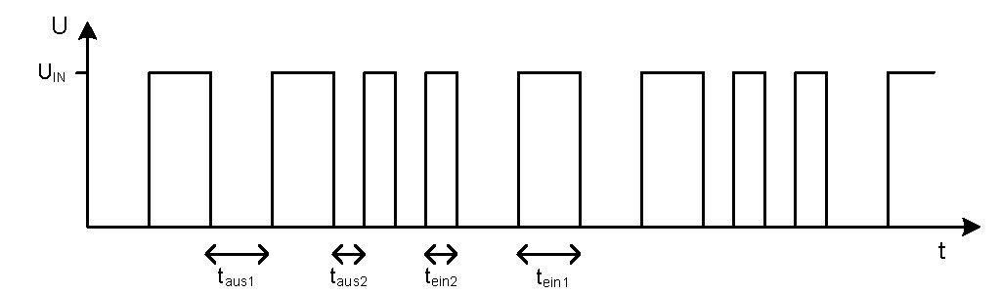

# Übung 11
## Frage 1 (20 Punkte)

*Einzelaufgabe:*

Bitte beantworten Sie kurz die folgenden Fragen. Sie benötigen hierfür das AVR Handbuch (welches Sie in den Kursunterlagen im Blackboard finden).
 
Nehmen Sie an, dass eine PWM-Einheit so konfiguriert wurde, dass über eine regelmäßige, interruptbasierte Aktualisierung des OCR2-Referenzregisters das folgende periodische Signal am Pin OC2 generiert wird (siehe [dutycycle.jpg](dutycycle.jpg)):
 
Berechnen Sie den duty cycle und die Effektivspannung Ueff unter der Annahme, dass tein1=taus1=28µs und tein2=taus2=14µs, sowie UIN=5V gegeben seien.

## Frage 2 (5 Punkte)

Nehmen Sie an, der ATmega8 befindet sich im "Power Down" Sleep-Mode. Ist ein ADC Event in der Lage den Controller aufzuwecken?

[ ] Ja 
[ ] Nein
   
## Frage 3 (5 Punkte)

In welchem Sleep Mode kann der Controller durch ein "Other I/O" Event aufgeweckt werden? 
		
[ ] Idle
[ ] Power Save
[ ] Standby
[ ] Power Down
[ ] ADC Noise Reduction
 
## Frage 4 (70 Punkte)

*Gruppenaufgabe:*

Im Übungsordner finden Sie ein Programm [engine_control.asm](engine_control.asm), welches die Status LED in Echtzeit (über den Timer 0 des Mikrocontrollers) in verschiedenen Farben mit Hilfe von Callback Funktionen1 ansteuert. Der Automat des Programms zur LED-Steuerung kennt dabei zwei Zustände: im Status S0 ist die Status-LED für 800ms grün, dann wird in den Zustand S1 gewechselt, der die Status-LED für 400ms auf rot stellt. Zusätzlich benötigt das Programm eine INCLUDE-Datei [asuro_macro.inc](asuro_macro.inc) mit Makrofunktionen  für den ASURO, die bereits einige Funktionen für die Steuerung der Status-LED implementiert. Diese Datei sollen Sie im Laufe dieser und der nächsten Übungen mit weiteren Funktionen ergänzen, die Ihnen sicherlich auch in Zukunft die Programmierung des ASURO in Assembler erleichtern wird. In dieser Aufgabe wollen wir z.B. Makros für die Motorensteuerung hinzufügen.
 
**(a)** In der Datei [asuro_macro.inc](asuro_macro.inc) ist bereits das Makro `FORWARD` gegeben, um die beiden Motoren des ASURO in Vorwärtsrichtung und auf eine definierte Geschwindigkeit zu setzen, die mit Hilfe konstanter Makroparameter `@0`, `@1` übergeben werden können. Ein Aufruf dieses Makros im Hauptprogramm könnte beispielsweise `FORWARD 255,255` sein, um die Motoren mit voller Kraft vorwärts laufen. Ergänzen Sie nun diese Datei mit Ihrem Wissen aus der Vorlesung um folgende Makros:
- `BACKWARD` zum Rückwärtsfahren; wie bei `FORWARD` werden zwei 8-Bit Konstanten als Geschwindigkeitsparameters für den linken und rechten Motor übergeben
- `TURNLEFT` zum Fahren einer Linksdrehung mit einem konstanten 8-Bit Geschwindigkeitsparameter. Beachten Sie dabei, dass der ASURO sich auf der Stelle dreht, d.h.der linke und rechte Motor sollen mit gleicher Geschwindigkeit in entgegengesetzte Richtung laufen.
- `TURNRIGHT` zum Fahren einer Rechtsdrehung, analog zu `TURNLEFT`
- `BRAKE zum` Einschalten der Motorbremse. Dieses Makro benötigt keine Übergabeparameter.
   
Geben Sie die Makrodatei [asuro_macro.inc](asuro_macro.inc) als Teil Ihrer Lösung ab. Da man im BB nur eine Antwortdatei hochladen kann, müssen sie diesmal eine zip- oder rar-Datei erstellen. Diese darf *nur* die inc-Datei und die asm-Datei Ihrer gesamten Lösung enthalten.
 
**(b)** Damit die Makrofunktionen zur Motorsteuerung auch genutzt werden können, müssen Sie die PWM-Kanäle des Timer 1 des ATMega noch im Hauptprogramm (genauer: in der `RESET`-Prozedur) konfigurieren. Fügen Sie nun die folgenden Konfigurationseinstellungen der PWM-Einheit A und B in Ihrem Programms ein. Das ATMega8 Handbuch hilft Ihnen ab Seite 95 bezüglich der genauen Bitkonfiguration weiter.
 
- Aktivieren der PWM-Schaltung im Timer 1 über die WGM-Flags des `TCCR1A`/`TCCR1B` Kontrollregisters. Wählen Sie hier für beide Kanäle die 8-Bit Phase Correct PWM aus.
- Setzen Sie den Vorteiler des Timer 1 über das `TCCR1B`-Kontrollregister auf `CLK/64`.
- Setzen Sie die Ausgabe der PWM über die beiden Pins `OC1A`/`OC1B` so, dass `OC1A`/`OC1B` jeweils gelöscht (auf Null gesetzt) werden, wenn beim Hochzählen die PWM den Referenzwert `OCR1A` bzw. `OCR1B` erreicht. Zählt die PWM (nach Erreichen des Maximalwertes 255) wieder herunter, soll beim erneuten Erreichen der Referenzwerte dann die Ausgabe in `OC1A`/`OC1B` wieder auf Eins gesetzt werden. Die Einstellung zum Verhalten der Pins `OC1A`/`OC1B` nehmen sie mit den `COM1A`/`COM1B` Flags im `TCCR1A`-Kontrollregister vor.
- Vergessen Sie nicht, die `OC1A`/`OC1B`-Pins auch im `DDR`-Register als Ausgang einzustellen, da sonst die von der PWM ausgegebenen Signale nicht am Motor ankommen (vgl. Seite 107 im ATMega8 Handbuch).
 
**(c)** Die gegebene LED-Automatensteuerung in [engine_control.asm](engine_control.asm) soll nun so durch die Makros für die Motorensteuerung ergänzt werden, so dass der ASURO im Zustand `S0` (während die grüne LED leuchtet) mit voller Kraft geradeaus fährt und im Zustand S1 (bei roter Status-LED) eine Linksdrehung mit halber Geschwindigkeit durchführt. Wenn alles tatsächlich funktioniert, sollte Ihr ASURO nun (abhängig von Ihrer Motorleistung) in etwa eine rechteckige Figur fahren. Probieren Sie es aus und geben Sie den Quellcode Ihres Programmes zusammen mit der inc-Datei als zip/rar-Archiv ab.
