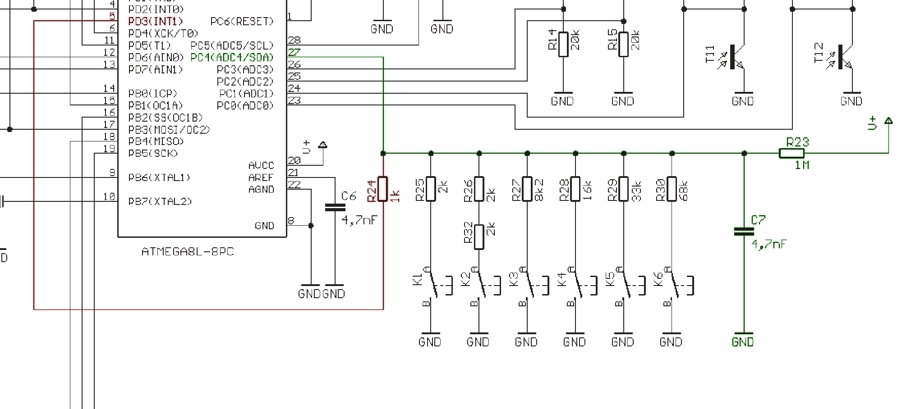
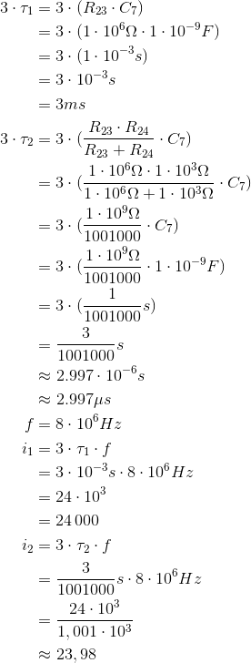

# Übung 12  
## Frage 3 (20 Punkte [Sonderpunkte])

*Einzelaufgabe:*

Bitte beantworten Sie kurz die folgenden Fragen. Sie benötigen hierfür das Asuro Handbuch (welches Sie in den Kursunterlagen im Blackboard finden) und evt. Informationen zur Zeitkonstante τ (http://de.wikipedia.org/wiki/Zeitkonstante).
 
Neben den Tastern sind an Pin PC4 auch noch R23 und C7 angeschlossen. Dieses sogenannte RC-Glied glättet Störungen der Versorgungsspannung um eine genauere Messung des ADC zu ermöglichen. Allerdings benötigt es eine gewisse Zeit um sich aufzuladen. Berechnen Sie die Zeit 3 ∗ τ, die das RC-Glied benötigt um sich auf ≈ 95% der Versorgungsspannung aufzuladen. Wie vielen Taktzyklen entspricht diese Zeit ungefähr? Um die Ladezeit zu verringern kann man über R24(an PD3) noch einen zusätzlichen Strompfad dazuschalten. Wie gross ist die Zeit 3 ∗ τ jetzt? Wie vielen Taktzyklen entspricht diese neue Zeit ungefähr?

### Lösung



Bauteile:
- Kondensator **C<sub>7</sub>** mit 4,7nF = **4,7 * 10<sup>-9</sup> F**
- Widerstand **R<sub>23</sub>** mit 1 MΩ = **1 * 10<sup>6</sup> Ω**
- Widerstand **R<sub>24</sub>** mit 1 kΩ = **1 * 10<sup>3</sup> Ω**



```LaTex
\begin{align*}
3 \cdot \tau_1 &= 3 \cdot (R_{23} \cdot C_7)\\
               &= 3 \cdot (1 \cdot 10^6  \Omega \cdot 1 \cdot 10^{-9} F)\\
               &= 3 \cdot (1 \cdot 10^{-3} s)\\
               &= 3 \cdot 10^{-3} s\\
               &= 3ms\\
3 \cdot \tau_2 &= 3 \cdot (\frac{R_{23} \cdot R_{24}}{R_{23}+R_{24}} \cdot C_7)\\
               &= 3 \cdot (\frac{1 \cdot 10^6 \Omega \cdot 1 \cdot 10^3 \Omega}{1 \cdot 10^6 \Omega + 1 \cdot 10^3 \Omega} \cdot C_7)\\
               &= 3 \cdot (\frac{1 \cdot 10^9 \Omega}{1001000} \cdot C_7)\\
               &= 3 \cdot (\frac{1 \cdot 10^9 \Omega}{1001000} \cdot 1 \cdot 10^{-9} F)\\
               &= 3 \cdot (\frac{1}{1001000} s)\\
               &= \frac{3}{1001000} s\\
               &\approx 2.997 \cdot 10^{-6} s\\
               &\approx 2.997 \mu s
f &= 8 \cdot 10^{6} Hz\\
i_1 &= 3 \cdot \tau_1 \cdot f\\
    &= 3 \cdot 10^{-3} s \cdot 8 \cdot 10^6 Hz\\
    &= 24 \cdot 10^{3}\\
    &= 24\,000\\
i_2 &= 3 \cdot \tau_2 \cdot f\\
    &= \frac{3}{1001000} s \cdot 8 \cdot 10^6 Hz\\
    &= \frac{24 \cdot 10^3}{1,001 \cdot 10^3}\\
    &\approx 23,98\\
\end{align*}
```
